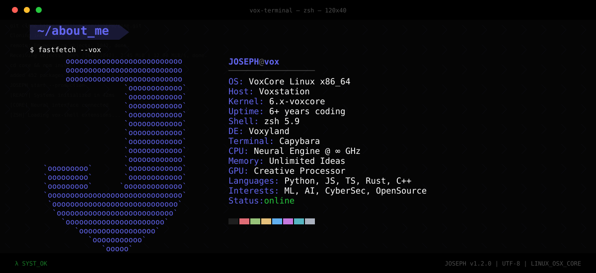

  

  

  
  

  
  
  

  

 

  

  

  

<!-- Current Focus Section -->

  

  

<!-- Table of Contents -->
<h2 align="center">Table of Contents</h2>

  
  
  
  

<b>Full Table of Contents</b>

- [Tech Stack & Tools](#-tech-stack--tools)
  - [Programming Languages](#programming-languages)
  - [Frameworks and Libraries](#frameworks-and-libraries)
  - [Databases & Cloud Hosting](#databases-and-cloud-hosting)
  - [Software & Tools](#software-and-tools)
  - [DevOps Tools](#devops-tools)
  - [Linux Distributions](#linux-distributions)
  - [Other Operating Systems](#other-operating-systems)
  - [Linux and Homelab Tools](#linux-and-homelab-tools)
  - [Virtualization Tools](#virtualization-tools)
- [GitHub Stats](#-github-stats)
- [Badges](#-badges)
- [Recent Activity](#-my-recent-activity)

 

  

<!-- Tech Stack Section -->
<h2 align="center" id="-tech-stack--tools">Tech Stack & Tools</h2>

  <i>Technologies and tools</i>

<h3 align="center">Programming Languages</h3>

<table>
<tr>
<td></td>
<td></td>
<td></td>
<td></td>
<td></td>
<td></td>
<td></td>
<td></td>
</tr>
</table>

<h3 align="center">Frameworks and Libraries</h3>

<table>
<tr>
<td></td>
<td></td>
<td></td>
<td></td>
<td></td>
<td></td>
<td></td>
<td></td>
<td></td>
<td></td>
</tr>
<tr>
<td></td>
<td></td>
<td></td>
</tr>
</table>

<h3 align="center">Databases and Cloud Hosting</h3>

<table>
<tr>
<td></td>
<td></td>
<td></td>
<td></td>
</tr>
</table>

<h3 align="center">Software and Tools</h3>

<table>
<tr>
<td></td>
<td></td>
<td></td>
<td></td>
<td></td>
<td></td>
<td></td>
</tr>
</table>

<h3 align="center">Other Operating Systems</h3>

<table>
<tr>
<td></td>
<td></td>
<td></td>
</tr>
</table>

 

  

<!-- GitHub Stats Section -->
<h2 align="center" id="-github-stats">GitHub Stats</h2>

  <i>Statistics overview</i>

  
  

 

  

  

 

  
  

 

  

<!-- Badges Section -->
<h2 align="center" id="-badges">Badges & Certifications</h2>

<b>View Certifications</b>

 

  <table>
    <tr>
      <td align="center" width="150">
        
         <b>IT Specialist - Cloud Computing</b>
      </td>
    </tr>
  </table>

 

  

<!-- Recent Activity Section -->
<h2 align="center" id="-my-recent-activity">Recent Activity</h2>

  <i>Recent contributions</i>

  
  <table>
    <tr>
      <td align="center">
        

          <!--RECENT_ACTIVITY:start-->
Building quietly.
<!--RECENT_ACTIVITY:end-->
        

      </td>
    </tr>
  </table>
  
   
  
  <em>
    <!--RECENT_ACTIVITY:last_update-->
Last Updated: Friday, October 9, 2026 at 5:18:06 PM
<!--RECENT_ACTIVITY:last_update_end-->
  </em>
  

  

<!-- Moira info start -->

### Moira — Autonomous AI Agent Companion

GitHub: [@Moira](https://github.com/MoiraZenovis)

Moira runs continuously on my home server to maintain and improve the environment under my direction. Responsibilities include automation & orchestration, monitoring and diagnostics, security and resilience, integrations across services, web/UI automation, and development/ops assistance. Moira provides concise, actionable alerts and maintains documentation and maintenance workflows to keep the system reliable and observable.

Key capabilities:

- Automation & orchestration (CI, scheduled jobs, self-healing flows)
- Monitoring, diagnostics & alerts (telemetry, triage, screenshots)
- Security & resilience (audits, hardening, recovery support)
- Integrations & interoperability (OpenClaw, Google Workspace, APIs)
- Web & UI automation (headless Chromium, Puppeteer)
- Dev & ops assistance (git, gh, GPG, builds, tests)

Presence: Discord is the principal notification channel.

<!-- Moira info end -->

  

  

"# josephtrill" 
